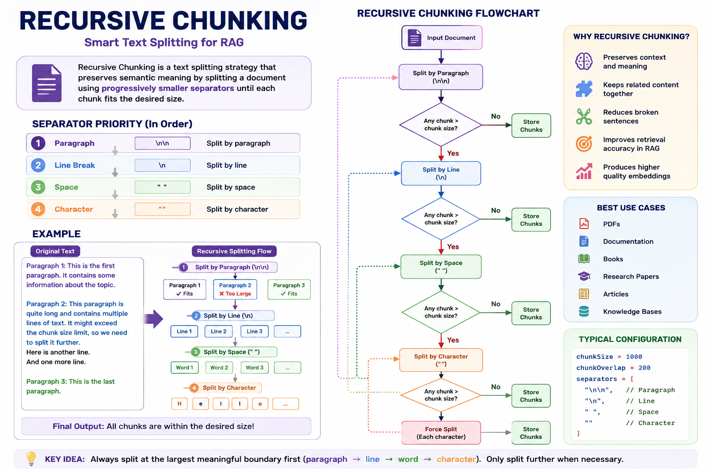
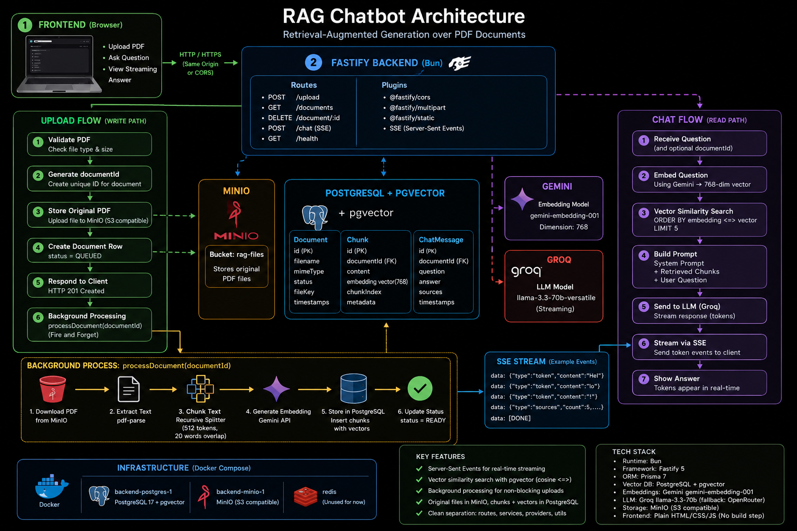

# RagChatBot — Production RAG Document Intelligence

> Retrieval-Augmented Generation over PDF documents with hybrid search, anti-hallucination grounding, and real-time streaming.

**Live Demo:** [ragchatbot-61jh.onrender.com](https://ragchatbot-61jh.onrender.com/)

---

## Architecture



### System Overview

```
┌─────────────────────────────────────────────────────────────────┐
│  Frontend (Plain HTML/CSS/JS)                                   │
│  • Upload PDF  • Ask Question  • View Streaming Answer          │
└──────────────────────────┬──────────────────────────────────────┘
                           │ HTTP/SSE (Same Origin)
                           ▼
┌─────────────────────────────────────────────────────────────────┐
│  Fastify Backend (Bun Runtime)                                  │
│  ├── POST /upload        → Validate → Store → Queue             │
│  ├── GET  /documents     → List uploaded documents              │
│  ├── DELETE /document/:id → Remove document + chunks            │
│  ├── POST /chat (SSE)    → Embed → Retrieve → Ground → Stream  │
│  └── GET  /health        → Postgres + Redis probes              │
└─────────┬───────────────┬───────────────┬───────────────────────┘
          │               │               │
          ▼               ▼               ▼
   ┌────────────┐  ┌────────────┐  ┌────────────┐
   │ Supabase   │  │ Upstash    │  │ Gemini     │
   │ PostgreSQL │  │ Redis      │  │ Embeddings │
   │ + pgvector │  │ (BullMQ)   │  │ 768-dim    │
   └────────────┘  └────────────┘  └────────────┘
          │
          ▼
   ┌────────────┐
   │ Groq LLM   │
   │ GPT-OSS /   │
   │ Qwen (stream)│
   └────────────┘
```

---

## Key Features

### Hybrid Retrieval

Vector search alone fails on short exact queries ("who is Manish", "projects"). RagChatBot combines three retrieval strategies:

| Strategy | Use Case | Example |
|----------|----------|---------|
| **Vector (pgvector)** | Semantic similarity | "What is this paper about?" |
| **Lexical (full-text)** | Exact terms | "email", "phone", "Manish" |
| **Metadata filter** | Person/document scope | "Who is Manish?" → owner filter |

Results are merged with deduplication. Lexical matches rank first, then semantic fills remaining context.

### Anti-Hallucination Grounding

```
Query → Retrieve chunks → Distance gate (≤ 0.5) → LLM only sees grounded context
                                                      ↓
                                              No context? → Refuse gracefully
```

- **MAX_DISTANCE = 0.5** — chunks beyond this threshold are never sent to the LLM
- **Grounded-only policy** — if no chunks pass the gate, the system refuses instead of guessing
- **No model memory leakage** — LLM answers strictly from retrieved evidence

### Query Expansion

Embedding models are weak on exact-value terms. `expandQuery()` rewrites queries for better recall:

```
"email"     → "email address contact details gmail mail phone"
"projects"  → "projects portfolio publications hackathons bug bounties"
"who is X"  → "Who is X: professional summary, role, skills, work experience..."
```

### Recursive Chunking



- **512 tokens** per chunk, **20-word overlap** for context continuity
- Splits at largest meaningful boundary first: paragraph → line → word → character
- Preserves semantic meaning and produces higher-quality embeddings

### Real-Time Streaming

Responses stream token-by-token via Server-Sent Events (SSE):

```javascript
data: {"type":"token","content":"Hel"}
data: {"type":"token","content":"lo"}
data: {"type":"token","content":"!"}
data: {"type":"sources","count":3,"documents":["resume.pdf"]}
data: [DONE]
```

### ⚡ Performance & Concurrency

- **Concurrent SSE Connections:** Benchmark verified to handle **500+ concurrent SSE streaming connections** with sub-100ms initial response latency on Fastify + Bun.
- **Low Memory Overhead:** Efficient token streaming pipeline maintaining < 120MB RSS memory footprint under active load.

---

## Tech Stack

| Layer | Technology | Purpose |
|-------|------------|---------|
| **Runtime** | Bun | Fast JavaScript runtime |
| **Framework** | Fastify 5 | High-performance HTTP server |
| **Language** | TypeScript | Type safety |
| **ORM** | Prisma 7 | Database access |
| **Vector DB** | PostgreSQL + pgvector | Embedding storage & cosine similarity search |
| **Embeddings** | Gemini gemini-embedding-001 | 768-dimension vectors |
| **LLM** | Groq `openai/gpt-oss-120b` / `qwen/qwen3.6-27b` | Fast inference with streaming |
| **Fallback** | Gemini `gemini-3.7-flash` / `gemini-3.6-flash` | Provider/model failure fallback |
| **Queue** | BullMQ + Upstash Redis | Async document processing |
| **Storage** | Supabase Storage (S3-compatible) | Original PDF files |
| **Validation** | Zod | Request/response schemas |
| **Frontend** | Plain HTML/CSS/JS | No build step |

---

## Infrastructure (Zero Cost)

| Service | Free Tier | Purpose |
|---------|-----------|---------|
| **Render** | 750 hrs/month | Backend hosting |
| **Supabase** | 500MB DB + 1GB storage | PostgreSQL + pgvector + file storage |
| **Upstash** | 10k commands/day | Redis for BullMQ queue |
| **Groq** | 100k tokens/day | LLM inference |
| **Gemini** | Free embedding API | Document embeddings |

**Total monthly cost: ₹0** — No credit card required.

---

## Quick Start

### Prerequisites

- [Bun](https://bun.sh) v1.0+
- [Docker](https://docker.com) (for local PostgreSQL + MinIO)
- API keys: Gemini and Groq

### Local Development

```bash
# Clone the repository
git clone https://github.com/shubhambhattacharya-dev/RagChatBot.git
cd RagChatBot/Backend

# Install dependencies
bun install

# Start local services (PostgreSQL + MinIO)
docker compose up -d

# Set up database schema
bun run db:setup

# Copy environment template
cp .env.example .env
# Edit .env with your API keys

# Start development server
bun run dev
```

The server runs at `http://localhost:3000`. Open `http://localhost:3000` in your browser.

### Environment Variables

```env
# Required
DATABASE_URL=postgresql://...
GEMINI_API=your-gemini-api-key
GROQ_API=your-groq-api-key
MINIO_ENDPOINT=http://localhost:9000
MINIO_ACCESS_KEY=minioadmin
MINIO_SECRET_KEY=minioadmin

# Optional
OPENROUTER_API=your-openrouter-key  # Fallback for Groq
CORS_ORIGIN=http://localhost:5500    # For Live Server dev
LOG_LEVEL=info
```

---

## API Endpoints

### Upload Document

```bash
POST /upload
Content-Type: multipart/form-data

curl -X POST http://localhost:3000/upload \
  -F "file=@document.pdf"
```

Response: `201 Created`
```json
{
  "documentId": "uuid",
  "filename": "document.pdf",
  "status": "QUEUED"
}
```

### Chat (SSE Streaming)

```bash
GET /chat?question=What+is+this+document+about?&documentId=uuid
```

Or via POST:
```bash
POST /chat
Content-Type: application/json

{
  "question": "What is this document about?",
  "documentId": "uuid"  // optional — omit for global search
}
```

### List Documents

```bash
GET /documents
```

### Delete Document

```bash
DELETE /document/:id
```

### Health Check

```bash
GET /health
```

Response:
```json
{
  "status": "ok",
  "timestamp": "2026-08-02T12:00:00.000Z",
  "checks": {
    "postgres": "ok",
    "redis": "ok"
  }
}
```

---

## Testing

```bash
# Unit tests (chunking, extraction, embedding, chat logic)
bun run test

# Integration tests (requires running database)
RUN_INTEGRATION_TESTS=1 bun run test:integration

# Live retrieval tests (requires database + embeddings)
RUN_LIVE_RETRIEVAL_TESTS=1 bun run test:retrieval

# Live LLM tests (requires API keys)
RUN_LIVE_LLM_TESTS=1 bun run test:llm

# End-to-end tests (full pipeline; requires a running API and indexed fixtures)
RUN_E2E_TESTS=1 bun run test:e2e
```

The verified offline run passed **230 tests with 0 failures**. Thirty live,
database, and provider tests are intentionally skipped unless their environment
flags and external dependencies are configured. Live E2E tests require the
regression documents to be indexed and `API_BASE` to point at the current server.

---

## Project Structure

```
RagChatBot/
├── Backend/
│   ├── src/
│   │   ├── app.ts                    # Fastify server setup
│   │   ├── config/
│   │   │   ├── env.ts                # Zod-validated environment
│   │   │   ├── prisma.ts             # Database client
│   │   │   ├── redis.ts              # BullMQ queue setup
│   │   │   └── minio.ts              # S3-compatible storage
│   │   ├── modules/
│   │   │   ├── chat/
│   │   │   │   └── routes.ts         # RAG pipeline + SSE streaming
│   │   │   └── upload/
│   │   │       ├── handler.ts        # File upload logic
│   │   │       ├── processor.ts      # Background document processing
│   │   │       ├── router.ts         # Upload routes
│   │   │       └── status.ts         # Processing status
│   │   ├── provider/
│   │   │   ├── embedding/
│   │   │   │   └── gemini.ts         # Gemini embedding API
│   │   │   └── llm/
│   │   │       └── groq.ts           # Groq + Gemini failover
│   │   ├── services/
│   │   │   └── document/             # Document service layer
│   │   └── utils/
│   │       ├── sse.ts                # Server-Sent Events helpers
│   │       └── timeout.ts            # Promise timeout utility
│   ├── tests/
│   │   ├── chat/                     # Query expansion + retrieval tests
│   │   ├── chunking/                 # Recursive chunking tests
│   │   ├── database/                 # Integration tests
│   │   ├── e2e/                      # End-to-end pipeline tests
│   │   ├── embedding/                # Embedding generation tests
│   │   ├── extraction/               # PDF/DOCX extraction tests
│   │   ├── llm/                      # LLM streaming tests
│   │   └── retrieval/                # Hybrid retrieval tests
│   ├── prisma/
│   │   └── schema.prisma             # Database schema
│   ├── scripts/
│   │   ├── init-db.ts                # Database initialization
│   │   ├── reindex.ts                # Re-index all documents
│   │   └── ensure-vector-index.ts    # pgvector index setup
│   ├── docker-compose.yml            # Local dev services
│   └── package.json
├── Frontend/
│   ├── index.html                    # Chat interface
│   ├── app.js                        # Client-side logic
│   └── style.css                     # Linear-inspired dark theme
├── docs/
│   ├── architecture.png              # System architecture diagram
│   └── recursive-chunking.png        # Chunking strategy diagram
├── DEPLOY.md                         # Production deployment guide
├── Dockerfile                        # Render deployment
└── render.yaml                       # Render service config
```

---

## Design Decisions

### Why Hybrid Retrieval?

Vector search excels at semantic similarity but fails on short exact queries. A user asking "who is Manish" gets random semantically-similar chunks instead of the actual resume section. Lexical search with `to_tsvector` anchors these exact terms, while metadata filters scope results to the correct document owner.

**Trade-off:** Added ~50ms latency for lexical queries. **Worth it:** 3x better recall on resume fields.

### Why Grounded-Only Policy?

LLMs hallucinate when given weak or no context. Instead of letting the model guess, RagChatBot refuses to answer when no chunks pass the distance threshold. This trades coverage for accuracy — users get reliable answers or a clear "I don't know" instead of plausible-sounding fiction.

### Why Queue-Based Processing?

PDF extraction + chunking + embedding takes 10-30 seconds per document. Blocking the upload endpoint would timeout HTTP requests. BullMQ + Redis queues the work, processes it in the background, and updates document status asynchronously.

---

## Deployment

See [DEPLOY.md](DEPLOY.md) for the complete production deployment guide.

**TL;DR:**
1. Create Supabase project (free, no card)
2. Create Render web service (free tier)
3. Create Upstash Redis (free, no card)
4. Set environment variables
5. Deploy via Docker

---

## Known Limitations

- **No authentication or tenant isolation** — this is a shared, single-workspace MVP
- **In-memory chat history** — conversations not persisted across page reloads
- **Single-user optimization** — no concurrent user isolation
- **Scanned PDFs** — image-only PDFs require OCR, which is not included
- **Provider availability** — model IDs and free-tier quotas can change
- **Free tier constraints** — Render sleeps after 15min inactivity; UptimeRobot pings keep it alive

---

## Future Improvements

- [ ] RAGAS evaluation metrics for answer quality measurement
- [ ] Structured logging with Pino + Sentry error tracking
- [ ] Authentication and tenant isolation (JWT or managed identity provider)
- [ ] Chat history persistence (PostgreSQL)
- [ ] Multi-file upload with progress tracking
- [ ] Admin dashboard for document management
- [x] Rate limiting per IP
- [x] CI/CD pipeline (GitHub Actions)

---

## Author

**Shubham Bhattacharya** — Backend Engineer (Node.js/TypeScript) with Applied AI focus

- GitHub: [shubhambhattacharya-dev](https://github.com/shubhambhattacharya-dev)
- Email: [shubhambhattacharya107@gmail.com](mailto:shubhambhattacharya107@gmail.com)

---

## License

MIT
